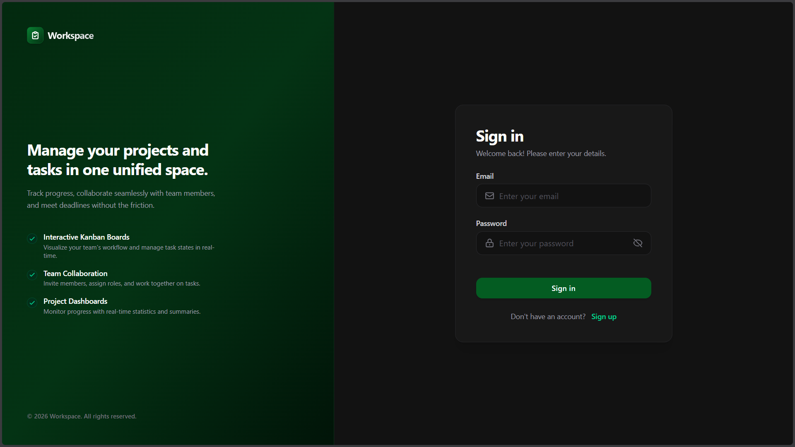
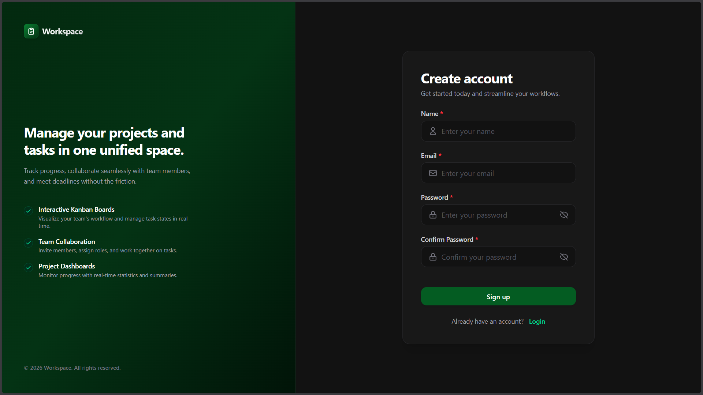
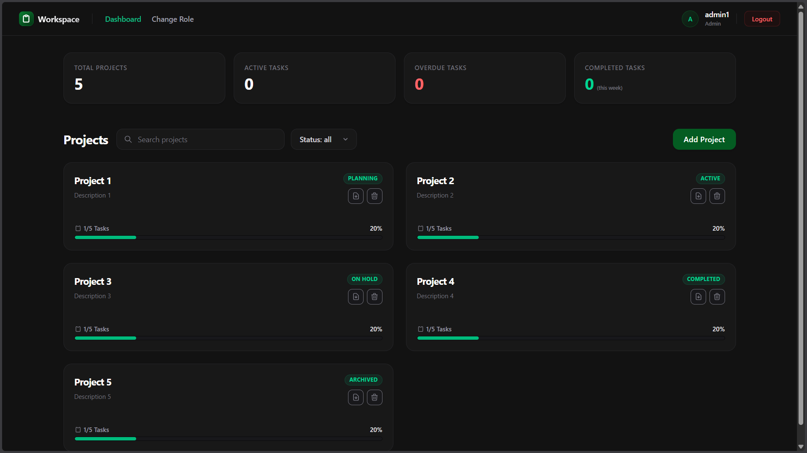
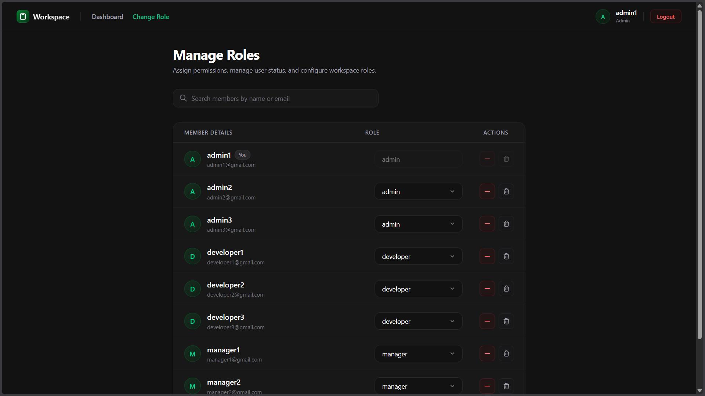
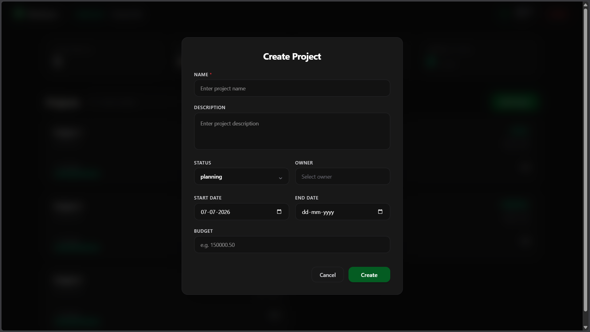
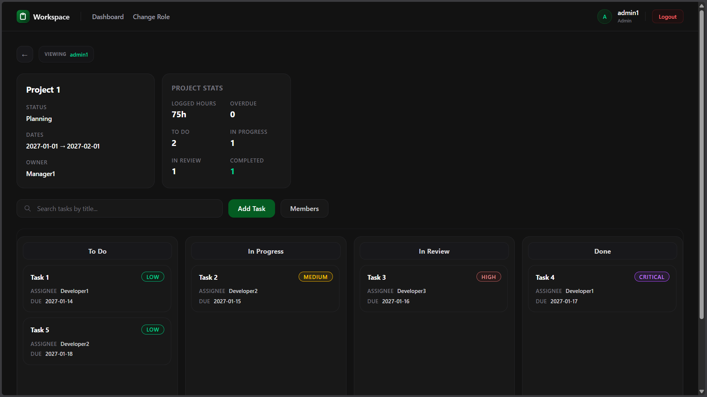
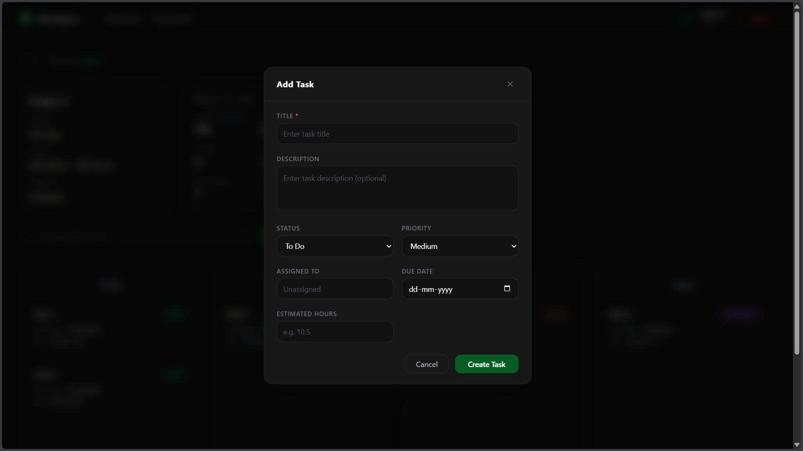
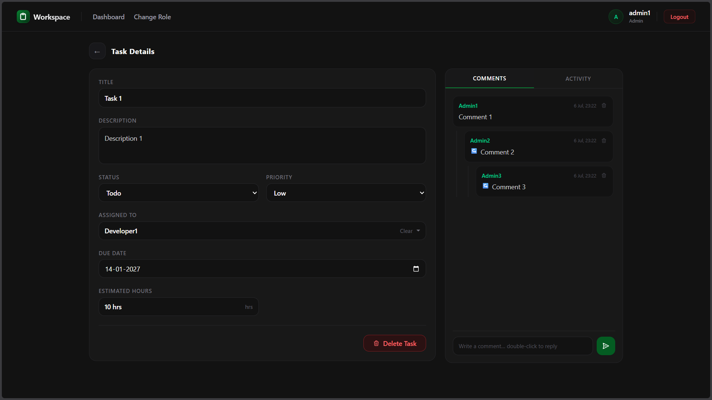

# Workspace - Smarter Project Management

A full-stack web application for tracking projects, tasks, and team collaboration in real time.

Built with **React 19 + TypeScript** on the frontend and **Node.js + Express + Prisma** on the backend, backed by **MariaDB** and **Redis**, with live updates powered by **Socket.io**.

---

## Screenshots

### Login


### Register


### Dashboard


### Admin — User Management


### Add Project


### Project Detail — Kanban Board


### Add Task


### Task Detail


---

## Features

- 📋 **Project Management** — Create, update, and archive projects with status tracking
- ✅ **Kanban Task Board** — Drag-and-drop task reordering across status columns
- 👥 **Team Collaboration** — Assign tasks to team members and manage project rosters
- 💬 **Threaded Comments** — Comment and reply directly on tasks
- 🔔 **Real-Time Notifications** — Live updates via Socket.io when tasks are created, updated, or assigned
- 👁️ **Live Presence** — See who else is viewing the same project board right now
- 📊 **Dashboard Statistics** — Track active, overdue, and completed tasks at a glance
- 📤 **CSV Export** — Download all tasks in a project as a CSV file
- 🔒 **Role-Based Access Control** — Admin, Manager, and Developer roles with granular permissions
- ♻️ **Token Refresh** — Silent JWT refresh via HTTPOnly cookies; no manual re-login needed

---

## Tech Stack

| Layer | Technology |
|---|---|
| Frontend | React 19, TypeScript, Vite 8, TailwindCSS v4 |
| Backend | Node.js (ESM), Express 5 |
| Database | MariaDB 10.11, Prisma ORM 7 |
| Cache / Rate Limiting | Redis 7 (ioredis) |
| Real-Time | Socket.io 4 |
| Auth | JWT (HTTPOnly cookies) |
| Containerisation | Docker, Docker Compose |
| Testing | Jest + Supertest (server), Vitest + Testing Library (client) |

---

## Quick Start

### Development

> Requires: Docker, Node.js 20+

```bash
# 1. Start database and Redis
docker compose -f docker-compose.dev.yml up -d

# 2. Configure environment
cp .env.example .env
cp server/.env.example server/.env
cp client/.env.example client/.env

# 3. Start backend
cd server && npm install && npm run prisma:migrate && npm run prisma:seed && npm run dev

# 4. Start frontend (new terminal)
cd client && npm install && npm run dev
```

Open [http://localhost:5173](http://localhost:5173).

### Production

> Requires: Docker only

```bash
cp .env.example .env   # Fill in secrets and passwords

docker compose up --build -d

# Optional: seed demo data
docker exec pm-server-prod npm run prisma:seed
```

Open [http://localhost](http://localhost).

---

## Documentation

| Document | Description |
|---|---|
| [docs/deployment.md](docs/deployment.md) | Full setup guide — environment variables, dev mode, production mode, Docker reference |
| [docs/architecture.md](docs/architecture.md) | System design — backend layers, frontend structure, real-time events, caching |
| [docs/database.md](docs/database.md) | Database schema — all tables, columns, indexes, FK rules, seed data |
| [docs/api.md](docs/api.md) | API reference — all endpoints with request/response examples |
| [docs/features.md](docs/features.md) | Detailed feature breakdown — what each feature does and how it works |
| [Postman/README.md](Postman/README.md) | Postman collection setup guide |

---

## Default Seed Accounts

After running `npm run prisma:seed`, you can log in with any of the following accounts:

| Role | Email | Password |
|---|---|---|
| Admin | admin1@gmail.com | `AdminPass@1` |
| Admin | admin2@gmail.com | `AdminPass@2` |
| Admin | admin3@gmail.com | `AdminPass@3` |
| Manager | manager1@gmail.com | `ManagerPass@1` |
| Manager | manager2@gmail.com | `ManagerPass@2` |
| Manager | manager3@gmail.com | `ManagerPass@3` |
| Developer | developer1@gmail.com | `DeveloperPass@1` |
| Developer | developer2@gmail.com | `DeveloperPass@2` |
| Developer | developer3@gmail.com | `DeveloperPass@3` |

---

## Project Structure

```
/
├── client/          # React + TypeScript frontend (Vite)
├── server/          # Node.js + Express backend
│   └── prisma/      # Schema, migrations, seed data
├── docs/            # Project documentation
│   └── screenshots/ # App screenshots
├── Postman/         # API collection + environment files
├── UI/              # Excalidraw wireframes (design reference)
├── docker-compose.yml       # Production stack
├── docker-compose.dev.yml   # Development infrastructure only
└── script.sql               # Raw DDL reference
```

---

## Running Tests

```bash
# Backend (Jest + Supertest)
cd server && npm run test

# Frontend (Vitest + Testing Library)
cd client && npm run test        # watch mode
cd client && npm run test:run    # single run
```
