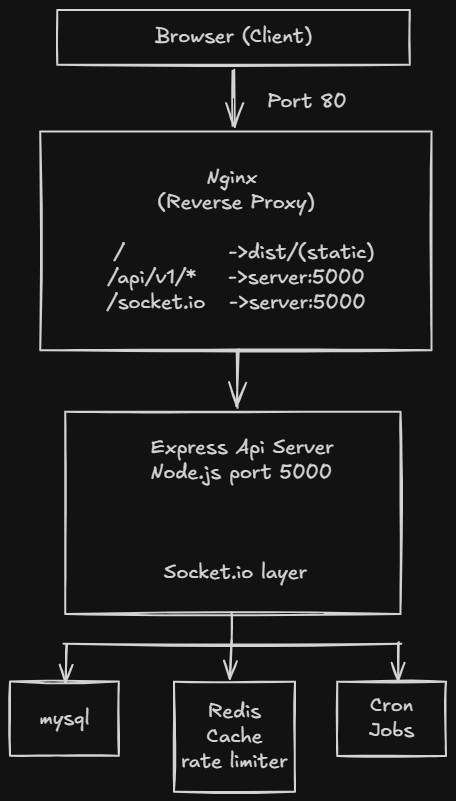

# Architecture Overview

This document describes the technical architecture of the **Workspace - Smarter Project Management** application — a full-stack web application for tracking projects, tasks, and team collaboration.

---

## Table of Contents

1. [System Overview](#1-system-overview)
2. [High-Level Architecture](#2-high-level-architecture)
3. [Backend Architecture](#3-backend-architecture)
4. [Frontend Architecture](#4-frontend-architecture)
5. [Database Schema](#5-database-schema)
6. [Real-Time Communication](#6-real-time-communication)
7. [Caching Strategy](#7-caching-strategy)
8. [Authentication & Security](#8-authentication--security)
9. [Infrastructure & Deployment](#9-infrastructure--deployment)

---

## 1. System Overview

| Concern | Technology |
|---|---|
| Frontend | React 19, TypeScript, Vite 8, TailwindCSS v4 |
| Backend | Node.js (ESM), Express 5 |
| Reverse Proxy | Nginx 1.25 (production) |
| Database | MariaDB 10.11 via Prisma ORM |
| Cache | Redis 7 (ioredis) |
| Real-time | Socket.io 4 |
| Containerisation | Docker + Docker Compose |
| Testing (server) | Jest + Supertest |
| Testing (client) | Vitest + Testing Library |

---

## 2. High-Level Architecture



---

## 3. Backend Architecture

### Entry Point

**[`server/index.js`](../server/index.js)** is the root entry point. It:
- Creates the Node.js HTTP server wrapping the Express `app`.
- Attaches the Socket.io server to the same HTTP server.
- Manages real-time project presence state via an in-memory `Map`.
- Connects to the database on startup.

**[`server/src/app.js`](../server/src/app.js)** configures the Express application:
- Registers global middleware (CORS, JSON parser, cookie parser, rate limiter).
- Mounts all versioned API route modules under `/api/v1/`.
- Attaches the global error handler as the final middleware.

---

### Request Lifecycle

Each incoming HTTP request flows through a layered middleware pipeline defined per route:

```
Request
  │
  ├─ 1. Global Middleware (CORS, Cookie Parser, Rate Limiter)
  │
  ├─ 2. Auth Middleware      — Validates accessToken JWT cookie; attaches req.user
  │
  ├─ 3. Param Loader         — Pre-fetches DB entity from URL params; attaches to req
  │        e.g. loadProjectBySlug → req.project
  │
  ├─ 4. Validator            — Validates request body via Zod schemas
  │        e.g. validateCreateProject, validateCreateTask
  │
  ├─ 5. Policy               — Authorises action based on user role + resource ownership
  │        e.g. ProjectPolicy.canUpdate, TaskPolicy.canCreate
  │
  └─ 6. Controller           — Handles business logic, queries DB, formats response
```

---

### Directory Structure (`server/src/`)

```
src/
├── app.js                  # Express app factory
├── controllers/            # Grouped by resource domain
│   ├── auth/               # register, login, logout, me, refresh
│   ├── project/
│   ├── task/
│   ├── comment/
│   ├── dashboard/
│   └── user/
├── routes/                 # Route definitions — connect URL → middleware chain → controller
│   ├── auth.routes.js
│   ├── project.routes.js
│   ├── task.routes.js
│   ├── comment.routes.js
│   ├── dashboard.routes.js
│   └── user.routes.js
├── middlewares/            # Cross-cutting concerns
│   ├── auth.middleware.js          # JWT cookie verification
│   ├── etag.middleware.js          # HTTP ETag / 304 caching
│   ├── rateLimiter.middleware.js   # Redis-backed rate limiting
│   └── error.middleware.js         # Global error handler
├── loaders/                # Param pre-fetchers (attach entity to req)
│   ├── project.loader.js
│   └── task.loader.js
├── policies/               # Authorisation guards (role + ownership checks)
│   ├── project.policy.js
│   └── task.policy.js
├── validators/             # Zod request body schemas
│   ├── project.validator.js
│   ├── task.validator.js
│   └── ...
├── serializers/            # Shape raw DB models into API response objects
│   ├── project.serializer.js
│   ├── task.serializer.js
│   └── user.serializer.js
├── services/               # Infrastructure utilities
│   ├── redis.service.js    # Cache get/set/invalidate helpers
│   ├── socket.service.js   # Broadcast helpers per event type
│   ├── cron.service.js     # Scheduled background jobs
│   ├── activity.service.js # Activity log creation helper
│   └── slug.service.js     # Unique slug generation
├── prisma/
│   └── client.js           # Extended Prisma client with custom query methods
└── utils/
    ├── response.js         # successResponse / errorResponse / paginatedResponse helpers
    └── asyncHandler.js     # Wraps async controllers to forward errors to the error middleware
```

---

### Key Middleware Details

| Middleware | Purpose |
|---|---|
| `auth.middleware.js` | Reads `accessToken` from HTTPOnly cookie, verifies JWT, confirms user is active in DB |
| `rateLimiter.middleware.js` | Redis-backed sliding window — 100 req/min for authenticated users, 20 req/min for guests (by IP) |
| `etag.middleware.js` | Intercepts `res.send()` on GET requests, computes an ETag hash, returns `304 Not Modified` when client ETag matches |
| `error.middleware.js` | Centralised error handler — catches errors thrown anywhere in the stack |

---

## 4. Frontend Architecture

### Technology Stack

| Layer | Technology |
|---|---|
| Framework | React 19 (function components, hooks) |
| Language | TypeScript 6 |
| Build Tool | Vite 8 |
| Styling | TailwindCSS v4 |
| Routing | React Router v7 |
| HTTP Client | Axios (with interceptors) |
| Real-time | Socket.io Client v4 |
| Drag & Drop | @dnd-kit/react |
| Testing | Vitest + Testing Library |

---

### Directory Structure (`client/src/`)

```
src/
├── App.tsx                 # Root component — router + provider setup
├── main.tsx                # React DOM entry point
├── index.css               # Global TailwindCSS styles
├── pages/                  # Page-level route components
│   ├── Dashboard.tsx        # Project list with filtering/search
│   ├── ProjectDetail.tsx    # Kanban board + task list
│   ├── TaskDetail.tsx       # Full task view with comments and activity
│   ├── Login.tsx
│   ├── Register.tsx
│   └── ChangeRole.tsx       # Admin user management
├── components/             # Colocated feature components (grouped by page)
│   ├── Dashboard/
│   │   ├── ProjectCard.tsx
│   │   ├── ProjectCardSkeleton.tsx
│   │   ├── AddProjectModal.tsx
│   │   ├── Stats.tsx
│   │   └── StatsSkeleton.tsx
│   ├── ProjectDetail/
│   │   ├── AddTaskModal.tsx
│   │   ├── ProjectDetailsCard.tsx
│   │   ├── ProjectMembersModal.tsx
│   │   └── ProjectStats.tsx
│   ├── TaskDetail/
│   │   ├── TaskDetailComponent.tsx
│   │   ├── TaskComments.tsx
│   │   └── TaskActivityTimeline.tsx
│   ├── Auth/
│   ├── ChangeRole/
│   ├── Navbar.tsx
│   ├── ProtectedRoute.tsx   # Guards authenticated routes
│   └── PublicRoute.tsx      # Guards guest-only routes
├── context/                # React Context providers
│   ├── AuthContext.ts       # Auth context type definition
│   ├── AuthProvider.tsx     # Session state, login/logout actions
│   └── NotificationProvider.tsx  # Socket.io real-time notification listener
├── hooks/                  # Custom React hooks
│   ├── useAuth.ts           # Consumes AuthContext
│   ├── useKanbanTasks.ts    # Kanban column state, filtering, pagination
│   ├── useTaskTransitions.ts # Status change with optimistic updates
│   └── useTaskReorder.ts    # Drag-and-drop reorder persistence
├── services/               # Network layer
│   ├── api.ts              # Axios instance + token refresh interceptor
│   └── socket.ts           # Socket.io client singleton
├── types/                  # Shared TypeScript type definitions
│   ├── project.ts
│   ├── auth.ts
│   ├── dashboard.ts
│   ├── forms.ts
│   └── index.ts
└── utils/                  # Utility helpers
```

---

### Routing

Route guards are implemented with React Router layout routes:

```
/login           → PublicRoute (redirects authenticated users to /)
/register        → PublicRoute

/                → ProtectedRoute → Dashboard
/projects/:slug  → ProtectedRoute → ProjectDetail
/projects/:slug/tasks/:taskId → ProtectedRoute → TaskDetail
/change-role     → ProtectedRoute → ChangeRole (Admin only)
```

---

### Authentication Flow (Client-Side)

1. `AuthProvider` calls `GET /auth/me` on mount to restore session from cookie.
2. On login, `POST /auth/login` is called; the server sets the `accessToken` HTTPOnly cookie.
3. All subsequent Axios requests automatically send the cookie (`withCredentials: true`).
4. If a request returns `401`, the Axios interceptor in `api.ts` automatically attempts `POST /auth/refresh`. If successful, the original request is retried; otherwise the user is redirected to `/login`.

---

## 5. Database Schema

The database is a **MariaDB 10.11** instance managed through **Prisma ORM**. All destructive operations use soft deletes (`deleted_at` timestamp).

### Entity Relationship Overview

```
users ──────────────────────── projects
  │         (owner_id)             │
  │                                │
  ├── team_members ────────────────┘ (project_id, user_id)
  │
  ├── tasks ──────────────────── projects (project_id)
  │     │   (assigned_to)
  │     └── comments (task_id, user_id, parent_id — nested replies)
  │
  ├── activity_logs (subject_type, subject_id — polymorphic)
  └── refresh_tokens (user_id, token, expires_at)
```

### Models & Enums

| Model | Key Fields |
|---|---|
| `users` | `id`, `name`, `email`, `password`, `role` (admin/manager/developer), `is_active`, `deleted_at` |
| `projects` | `id`, `name`, `slug` (unique), `status`, `owner_id`, `start_date`, `end_date`, `budget`, `deleted_at` |
| `tasks` | `id`, `project_id`, `title`, `status`, `priority`, `assigned_to`, `sort_order`, `due_date`, `estimated_hours`, `actual_hours`, `deleted_at` |
| `comments` | `id`, `task_id`, `user_id`, `body`, `parent_id` (threaded), `deleted_at` |
| `team_members` | `id`, `project_id`, `user_id`, `deleted_at` |
| `activity_logs` | `id`, `subject_type`, `subject_id`, `user_id`, `action`, `properties` |
| `refresh_tokens` | `id`, `user_id`, `refresh_token`, `expires_at` |

| Enum | Values |
|---|---|
| `projects_status` | `planning`, `active`, `on_hold`, `completed`, `archived` |
| `tasks_status` | `todo`, `in_progress`, `in_review`, `done` |
| `tasks_priority` | `low`, `medium`, `high`, `critical` |
| `users_role` | `admin`, `manager`, `developer` |

---

## 6. Real-Time Communication

Socket.io powers two categories of real-time events:

### Project Room Events (Kanban board)

Users who open a project are joined to a `project:<slug>` Socket.io room. Any mutation (task created, updated, deleted, status changed, comment added) broadcasts an event to all connected members of that room.

| Event Emitted | Trigger |
|---|---|
| `task:created` | New task created under a project |
| `task:updated` | Task fields (title, priority, etc.) updated |
| `task:status_changed` | Task status changed via PATCH |
| `task:assigned` | Task assigned/reassigned to a user |
| `task:deleted` | Task soft-deleted |
| `comment:added` | New comment posted on a task |
| `comment:updated` | Existing comment edited |
| `comment:deleted` | Comment deleted |
| `project:presence` | Emitted on join/leave; contains current list of active users in the project room |

### User Notification Events (Personal room)

Each authenticated user is also joined to a private `user:<id>` room on login. Targeted notifications are sent to this room:

| Event Emitted | Trigger |
|---|---|
| `task:assigned_notification` | A task is assigned to the user, reassigned away, or a comment is added to their task |

---

## 7. Caching Strategy

### Redis — Project Stats Cache

Project statistics (task counts by status, total hours, overdue count) are expensive aggregation queries. They are cached in Redis per project slug.

| Operation | Key Pattern | TTL |
|---|---|---|
| `getCachedStats` | `project:stats:<slug>` | Read-through |
| `setCachedStats` | `project:stats:<slug>` | 24 hours |
| `invalidateProjectStats` | `project:stats:<slug>` | Deleted on task mutation |

### HTTP Caching — ETag

The `etagMiddleware` generates an ETag hash for every successful `GET` response. If the client sends `If-None-Match` with a matching ETag, the server returns `304 Not Modified` with an empty body, saving bandwidth.

### Redis — Rate Limiting

The `rateLimiterMiddleware` uses Redis counters for a 60-second sliding window:
- **Authenticated users:** identified by `user:<id>` — limit: **100 req/min**
- **Guests:** identified by `ip:<ip>` — limit: **20 req/min**

---

## 8. Authentication & Security

### Token Strategy: Dual JWT (HTTPOnly Cookies)

| Token | Storage | TTL | Purpose |
|---|---|---|---|
| `accessToken` | HTTPOnly Cookie | Short-lived | Authenticates API requests |
| `refreshToken` | HTTPOnly Cookie | Long-lived | Issues new access tokens silently |

- HTTPOnly cookies prevent XSS-based token theft.
- Refresh tokens are stored in the `refresh_tokens` DB table with an `expires_at` timestamp.
- A daily cron job (`cron.service.js`) purges expired refresh tokens at midnight.

### Role-Based Access Control (RBAC)

| Role | Permissions |
|---|---|
| `admin` | Full access — create/update/delete all projects, change user roles, delete/restore users |
| `manager` | Create projects; update/delete projects they own; manage team members |
| `developer` | View assigned projects and tasks; update task status; comment |

Authorisation is enforced at the route level by **Policy** middleware classes (`ProjectPolicy`, `TaskPolicy`) before the controller executes.

---

## 9. Infrastructure & Deployment

### Docker Services

The application is fully containerised with two Docker Compose configurations:

**Development (`docker-compose.dev.yml`):** Spins up only infrastructure services. The Node.js server and Vite dev server run locally on the host machine.

| Service | Image | Port |
|---|---|---|
| `mysql` (dev) | `mariadb:10.11` | `3307:3306` |
| `redis` (dev) | `redis:7-alpine` | `6379:6379` |

**Production (`docker-compose.yml`):** All four services run in containers.

| Service | Image / Build | Port | Notes |
|---|---|---|---|
| `mysql` | `mariadb:10.11` | `3307:3306` | Persisted volume |
| `redis` | `redis:7-alpine` | Internal | Persisted volume |
| `server` | `./server/Dockerfile` | `5000:5000` | Runs `prisma migrate deploy` on startup |
| `client` | `./client/Dockerfile` | `80:80` | Served via Nginx |

### Service Startup Order (Production)

```
MariaDB (healthy) ──┐
                    ├──► server (runs migrations + starts) ──► client (Nginx)
Redis   (healthy) ──┘
```

### UI Design Reference

The [`/UI`](../UI/) directory contains Excalidraw wireframes and PNG exports for all key screens (Dashboard, Login, Register, Project Detail, Task Detail, Change Role) in both light and dark modes. These served as the design specification during development.
