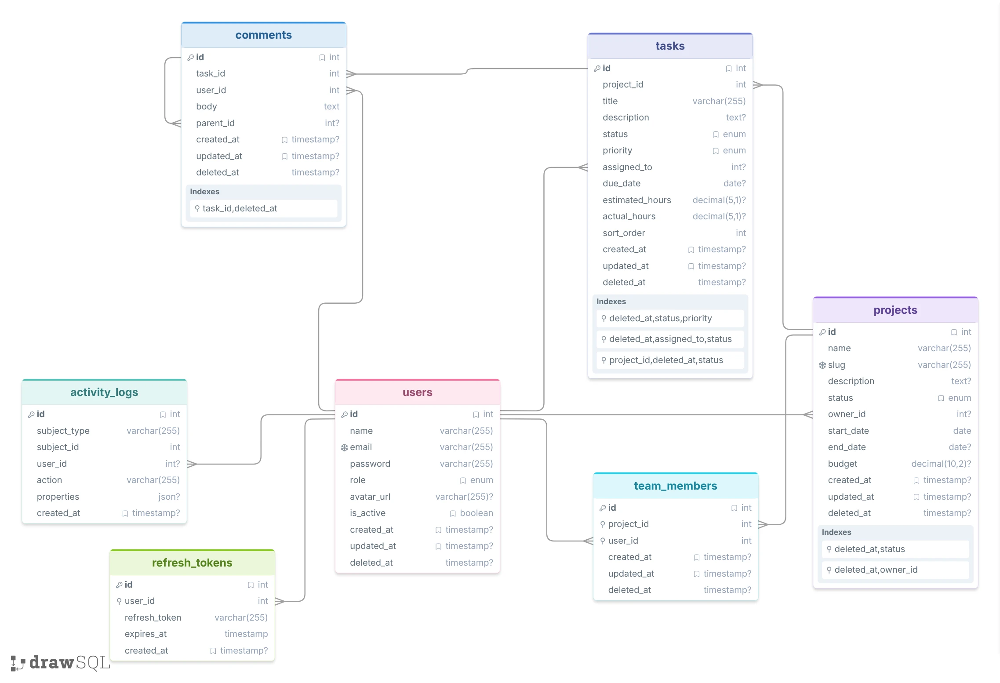

# Database Documentation

This document covers the complete database design for the Workspace - Smarter Project Management application — including schema, table definitions, relationships, constraints, indexes, and seed data.

---

## Table of Contents

1. [Overview](#1-overview)
2. [Entity Relationship Diagram](#2-entity-relationship-diagram)
3. [Tables](#3-tables)
   - [users](#31-users)
   - [projects](#32-projects)
   - [tasks](#33-tasks)
   - [comments](#34-comments)
   - [team_members](#35-team_members)
   - [activity_logs](#36-activity_logs)
   - [refresh_tokens](#37-refresh_tokens)
4. [Enums](#4-enums)
5. [Indexes](#5-indexes)
6. [Foreign Keys & Cascade Rules](#6-foreign-keys--cascade-rules)
7. [Soft Deletes](#7-soft-deletes)
8. [Seed Data](#8-seed-data)
9. [Migrations & Tooling](#9-migrations--tooling)

---

## 1. Overview

| Property | Value |
|---|---|
| Engine | MariaDB 10.11 |
| ORM | Prisma 7 (adapter: `@prisma/adapter-mariadb`) |
| Schema source | [`server/prisma/schema.prisma`](../server/prisma/schema.prisma) |
| Reference DDL | [`script.sql`](../script.sql) |
| Seed script | [`server/prisma/seed.js`](../server/prisma/seed.js) |
| Seed command | `npm run prisma:seed` (inside `/server`) |

All tables use:
- `INT UNSIGNED AUTO_INCREMENT` primary keys
- `TIMESTAMP DEFAULT CURRENT_TIMESTAMP` for `created_at`
- `TIMESTAMP ... ON UPDATE CURRENT_TIMESTAMP` for `updated_at`
- Soft-delete pattern via a nullable `deleted_at TIMESTAMP` column

---

## 2. Entity Relationship Diagram



---

## 3. Tables

### 3.1 `users`

Stores all user accounts regardless of role.

```sql
CREATE TABLE users (
    id         INT UNSIGNED AUTO_INCREMENT PRIMARY KEY,
    name       VARCHAR(255) NOT NULL,
    email      VARCHAR(255) NOT NULL UNIQUE,
    password   VARCHAR(255) NOT NULL,
    role       ENUM('admin','manager','developer') NOT NULL DEFAULT 'developer',
    avatar_url VARCHAR(255) NULL,
    is_active  BOOLEAN NOT NULL DEFAULT TRUE,
    created_at TIMESTAMP DEFAULT CURRENT_TIMESTAMP,
    updated_at TIMESTAMP DEFAULT CURRENT_TIMESTAMP ON UPDATE CURRENT_TIMESTAMP,
    deleted_at TIMESTAMP NULL
);
```

| Column | Type | Nullable | Default | Notes |
|---|---|---|---|---|
| `id` | INT UNSIGNED | No | auto | Primary key |
| `name` | VARCHAR(255) | No | — | Display name |
| `email` | VARCHAR(255) | No | — | Unique; used for login |
| `password` | VARCHAR(255) | No | — | bcrypt hash (cost 12) |
| `role` | ENUM | No | `developer` | See [Enums](#4-enums) |
| `avatar_url` | VARCHAR(255) | Yes | NULL | Profile picture URL |
| `is_active` | BOOLEAN | No | `TRUE` | When `FALSE`, login is blocked |
| `created_at` | TIMESTAMP | Yes | now() | — |
| `updated_at` | TIMESTAMP | Yes | now() | Auto-updated on row change |
| `deleted_at` | TIMESTAMP | Yes | NULL | Soft delete marker |

---

### 3.2 `projects`

Stores all projects. Each project is identified by a unique human-readable `slug`.

```sql
CREATE TABLE projects (
    id          INT UNSIGNED AUTO_INCREMENT PRIMARY KEY,
    name        VARCHAR(255) NOT NULL,
    slug        VARCHAR(255) NOT NULL UNIQUE,
    description TEXT NULL,
    status      ENUM('planning','active','on_hold','completed','archived') NOT NULL DEFAULT 'planning',
    owner_id    INT UNSIGNED NULL,
    start_date  DATE NOT NULL,
    end_date    DATE NULL,
    budget      DECIMAL(10,2) NULL,
    created_at  TIMESTAMP DEFAULT CURRENT_TIMESTAMP,
    updated_at  TIMESTAMP DEFAULT CURRENT_TIMESTAMP ON UPDATE CURRENT_TIMESTAMP,
    deleted_at  TIMESTAMP NULL,
    CONSTRAINT fk_project_owner FOREIGN KEY (owner_id) REFERENCES users(id) ON DELETE SET NULL
);
```

| Column | Type | Nullable | Default | Notes |
|---|---|---|---|---|
| `id` | INT UNSIGNED | No | auto | Primary key |
| `name` | VARCHAR(255) | No | — | Display name |
| `slug` | VARCHAR(255) | No | — | Unique URL identifier |
| `description` | TEXT | Yes | NULL | — |
| `status` | ENUM | No | `planning` | See [Enums](#4-enums) |
| `owner_id` | INT UNSIGNED | Yes | NULL | FK → `users.id`; `SET NULL` on user delete |
| `start_date` | DATE | No | — | — |
| `end_date` | DATE | Yes | NULL | — |
| `budget` | DECIMAL(10,2) | Yes | NULL | Currency value |
| `created_at` | TIMESTAMP | Yes | now() | — |
| `updated_at` | TIMESTAMP | Yes | now() | Auto-updated on row change |
| `deleted_at` | TIMESTAMP | Yes | NULL | Soft delete marker |

---

### 3.3 `tasks`

Tasks belong to a project and can be assigned to a user. `sort_order` drives the Kanban column order.

```sql
CREATE TABLE tasks (
    id              INT UNSIGNED AUTO_INCREMENT PRIMARY KEY,
    project_id      INT UNSIGNED NOT NULL,
    title           VARCHAR(255) NOT NULL,
    description     TEXT NULL,
    status          ENUM('todo','in_progress','in_review','done') NOT NULL DEFAULT 'todo',
    priority        ENUM('low','medium','high','critical') NOT NULL DEFAULT 'medium',
    assigned_to     INT UNSIGNED NULL,
    due_date        DATE NULL,
    estimated_hours DECIMAL(5,1) NULL,
    actual_hours    DECIMAL(5,1) NULL,
    sort_order      INT NOT NULL DEFAULT 0,
    created_at      TIMESTAMP DEFAULT CURRENT_TIMESTAMP,
    updated_at      TIMESTAMP DEFAULT CURRENT_TIMESTAMP ON UPDATE CURRENT_TIMESTAMP,
    deleted_at      TIMESTAMP NULL,
    CONSTRAINT fk_task_project       FOREIGN KEY (project_id) REFERENCES projects(id) ON DELETE CASCADE,
    CONSTRAINT fk_task_assigned_user FOREIGN KEY (assigned_to) REFERENCES users(id)   ON DELETE SET NULL
);
```

| Column | Type | Nullable | Default | Notes |
|---|---|---|---|---|
| `id` | INT UNSIGNED | No | auto | Primary key |
| `project_id` | INT UNSIGNED | No | — | FK → `projects.id`; `CASCADE` on project delete |
| `title` | VARCHAR(255) | No | — | — |
| `description` | TEXT | Yes | NULL | — |
| `status` | ENUM | No | `todo` | See [Enums](#4-enums) |
| `priority` | ENUM | No | `medium` | See [Enums](#4-enums) |
| `assigned_to` | INT UNSIGNED | Yes | NULL | FK → `users.id`; `SET NULL` on user delete |
| `due_date` | DATE | Yes | NULL | — |
| `estimated_hours` | DECIMAL(5,1) | Yes | NULL | Planned effort in hours |
| `actual_hours` | DECIMAL(5,1) | Yes | NULL | Logged effort in hours |
| `sort_order` | INT | No | `0` | Controls Kanban card ordering within a column |
| `created_at` | TIMESTAMP | Yes | now() | — |
| `updated_at` | TIMESTAMP | Yes | now() | Auto-updated on row change |
| `deleted_at` | TIMESTAMP | Yes | NULL | Soft delete marker |

---

### 3.4 `comments`

Threaded comments on tasks. `parent_id` enables one level of replies (comment → reply chain).

```sql
CREATE TABLE comments (
    id         INT UNSIGNED AUTO_INCREMENT PRIMARY KEY,
    task_id    INT UNSIGNED NOT NULL,
    user_id    INT UNSIGNED NOT NULL,
    body       TEXT NOT NULL,
    parent_id  INT UNSIGNED NULL,
    created_at TIMESTAMP DEFAULT CURRENT_TIMESTAMP,
    updated_at TIMESTAMP DEFAULT CURRENT_TIMESTAMP ON UPDATE CURRENT_TIMESTAMP,
    deleted_at TIMESTAMP NULL,
    CONSTRAINT fk_comment_task   FOREIGN KEY (task_id)   REFERENCES tasks(id)    ON DELETE CASCADE,
    CONSTRAINT fk_comment_user   FOREIGN KEY (user_id)   REFERENCES users(id)    ON DELETE CASCADE,
    CONSTRAINT fk_comment_parent FOREIGN KEY (parent_id) REFERENCES comments(id) ON DELETE SET NULL
);
```

| Column | Type | Nullable | Default | Notes |
|---|---|---|---|---|
| `id` | INT UNSIGNED | No | auto | Primary key |
| `task_id` | INT UNSIGNED | No | — | FK → `tasks.id`; `CASCADE` on task delete |
| `user_id` | INT UNSIGNED | No | — | FK → `users.id`; `CASCADE` on user delete |
| `body` | TEXT | No | — | Comment content |
| `parent_id` | INT UNSIGNED | Yes | NULL | Self-referencing FK; `SET NULL` when parent deleted |
| `created_at` | TIMESTAMP | Yes | now() | — |
| `updated_at` | TIMESTAMP | Yes | now() | Auto-updated on row change |
| `deleted_at` | TIMESTAMP | Yes | NULL | Soft delete marker |

---

### 3.5 `team_members`

Junction table linking users to projects as team members.

```sql
CREATE TABLE team_members (
    id         INT UNSIGNED AUTO_INCREMENT PRIMARY KEY,
    project_id INT UNSIGNED NOT NULL,
    user_id    INT UNSIGNED NOT NULL,
    created_at TIMESTAMP DEFAULT CURRENT_TIMESTAMP,
    updated_at TIMESTAMP DEFAULT CURRENT_TIMESTAMP ON UPDATE CURRENT_TIMESTAMP,
    deleted_at TIMESTAMP NULL,
    CONSTRAINT fk_team_members_project FOREIGN KEY (project_id) REFERENCES projects(id) ON DELETE CASCADE,
    CONSTRAINT fk_team_members_user    FOREIGN KEY (user_id)    REFERENCES users(id)    ON DELETE CASCADE
);
```

| Column | Type | Nullable | Default | Notes |
|---|---|---|---|---|
| `id` | INT UNSIGNED | No | auto | Primary key |
| `project_id` | INT UNSIGNED | No | — | FK → `projects.id`; `CASCADE` on project delete |
| `user_id` | INT UNSIGNED | No | — | FK → `users.id`; `CASCADE` on user delete |
| `created_at` | TIMESTAMP | Yes | now() | — |
| `updated_at` | TIMESTAMP | Yes | now() | — |
| `deleted_at` | TIMESTAMP | Yes | NULL | Soft delete marker |

---

### 3.6 `activity_logs`

Polymorphic audit log. Records every significant action performed by users (task created, status changed, comment added, etc.).

```sql
CREATE TABLE activity_logs (
    id           INT UNSIGNED AUTO_INCREMENT PRIMARY KEY,
    subject_type VARCHAR(255) NOT NULL,
    subject_id   INT UNSIGNED NOT NULL,
    user_id      INT UNSIGNED NULL,
    action       VARCHAR(255) NOT NULL,
    properties   JSON NULL,
    created_at   TIMESTAMP DEFAULT CURRENT_TIMESTAMP,
    CONSTRAINT fk_activity_logs_user FOREIGN KEY (user_id) REFERENCES users(id) ON DELETE SET NULL
);
```

| Column | Type | Nullable | Default | Notes |
|---|---|---|---|---|
| `id` | INT UNSIGNED | No | auto | Primary key |
| `subject_type` | VARCHAR(255) | No | — | Type of entity acted on (e.g. `"task"`, `"comment"`) |
| `subject_id` | INT UNSIGNED | No | — | ID of the entity acted on |
| `user_id` | INT UNSIGNED | Yes | NULL | FK → `users.id`; `SET NULL` on user delete; who performed the action |
| `action` | VARCHAR(255) | No | — | Action description (e.g. `"created"`, `"status_changed"`) |
| `properties` | JSON | Yes | NULL | Additional metadata (e.g. old/new values) |
| `created_at` | TIMESTAMP | Yes | now() | — |

> **Note:** `activity_logs` has no `updated_at` or `deleted_at` — logs are append-only and never modified.

---

### 3.7 `refresh_tokens`

Stores long-lived refresh tokens for the JWT token rotation strategy.

```sql
CREATE TABLE refresh_tokens (
    id            INT UNSIGNED AUTO_INCREMENT PRIMARY KEY,
    user_id       INT UNSIGNED NOT NULL,
    refresh_token VARCHAR(255) NOT NULL,
    expires_at    TIMESTAMP NOT NULL,
    created_at    TIMESTAMP DEFAULT CURRENT_TIMESTAMP,
    CONSTRAINT fk_refresh_token_user FOREIGN KEY (user_id) REFERENCES users(id) ON DELETE CASCADE
);
```

| Column | Type | Nullable | Default | Notes |
|---|---|---|---|---|
| `id` | INT UNSIGNED | No | auto | Primary key |
| `user_id` | INT UNSIGNED | No | — | FK → `users.id`; `CASCADE` on user delete |
| `refresh_token` | VARCHAR(255) | No | — | Opaque token string |
| `expires_at` | TIMESTAMP | No | — | Token expiry time |
| `created_at` | TIMESTAMP | No | now() | — |

> **Cleanup:** A nightly cron job (running at `00:00`) automatically deletes rows where `expires_at < NOW()`. See [`server/src/services/cron.service.js`](../server/src/services/cron.service.js).

---

## 4. Enums

### `users_role`
| Value | Description |
|---|---|
| `admin` | Full platform access — user management, all projects |
| `manager` | Can create and manage projects they own |
| `developer` | Can view assigned projects; update task status; comment |

### `projects_status`
| Value | Description |
|---|---|
| `planning` | Project is being scoped |
| `active` | Project is in progress |
| `on_hold` | Temporarily paused |
| `completed` | All work finished |
| `archived` | Closed; hidden from active views |

### `tasks_status`
| Value | Description |
|---|---|
| `todo` | Not started |
| `in_progress` | Work has begun |
| `in_review` | Under review / QA |
| `done` | Completed |

### `tasks_priority`
| Value | Description |
|---|---|
| `low` | Nice to have |
| `medium` | Standard priority |
| `high` | Important; do soon |
| `critical` | Blocking; do immediately |

---

## 5. Indexes

### `projects`
| Index Name | Columns | Purpose |
|---|---|---|
| `slug` (UNIQUE) | `slug` | Fast project lookup by URL slug |
| `fk_project_owner` | `owner_id` | FK join performance |
| `idx_projects_deleted_status` | `(deleted_at, status)` | Filtered list queries (`WHERE deleted_at IS NULL AND status = ?`) |
| `idx_projects_deleted_owner` | `(deleted_at, owner_id)` | Filtered list by owner (`WHERE deleted_at IS NULL AND owner_id = ?`) |

### `tasks`
| Index Name | Columns | Purpose |
|---|---|---|
| `fk_task_project` | `project_id` | FK join performance |
| `fk_task_assigned_user` | `assigned_to` | FK join performance |
| `idx_tasks_project_deleted_status` | `(project_id, deleted_at, status)` | Task list per project with status filter |
| `idx_tasks_deleted_assigned_status` | `(deleted_at, assigned_to, status)` | Dashboard "my tasks" queries |
| `idx_tasks_deleted_status_priority` | `(deleted_at, status, priority)` | Priority-filtered task views |

### `comments`
| Index Name | Columns | Purpose |
|---|---|---|
| `fk_comment_task` | `task_id` | FK join performance |
| `fk_comment_user` | `user_id` | FK join performance |
| `fk_comment_parent` | `parent_id` | Self-referencing FK join |
| `idx_comments_task_deleted` | `(task_id, deleted_at)` | Comment list per task excluding soft-deleted |

### `team_members`
| Index Name | Columns | Purpose |
|---|---|---|
| `fk_team_members_project` | `project_id` | FK join / team member list per project |
| `fk_team_members_user` | `user_id` | FK join / projects per user |

### `activity_logs`
| Index Name | Columns | Purpose |
|---|---|---|
| `fk_activity_logs_user` | `user_id` | FK join performance |

### `refresh_tokens`
| Index Name | Columns | Purpose |
|---|---|---|
| `fk_refresh_token_user` | `user_id` | FK join; lookup tokens per user |

---

## 6. Foreign Keys & Cascade Rules

| Constraint | Child Table | Child Column | Parent Table | Parent Column | On Delete |
|---|---|---|---|---|---|
| `fk_project_owner` | `projects` | `owner_id` | `users` | `id` | **SET NULL** — project survives if owner is deleted |
| `fk_task_project` | `tasks` | `project_id` | `projects` | `id` | **CASCADE** — tasks are deleted with the project |
| `fk_task_assigned_user` | `tasks` | `assigned_to` | `users` | `id` | **SET NULL** — task survives; becomes unassigned |
| `fk_comment_task` | `comments` | `task_id` | `tasks` | `id` | **CASCADE** — comments deleted with the task |
| `fk_comment_user` | `comments` | `user_id` | `users` | `id` | **CASCADE** — comments deleted with the user |
| `fk_comment_parent` | `comments` | `parent_id` | `comments` | `id` | **SET NULL** — reply orphaned if parent deleted |
| `fk_team_members_project` | `team_members` | `project_id` | `projects` | `id` | **CASCADE** — memberships deleted with the project |
| `fk_team_members_user` | `team_members` | `user_id` | `users` | `id` | **CASCADE** — memberships deleted with the user |
| `fk_activity_logs_user` | `activity_logs` | `user_id` | `users` | `id` | **SET NULL** — log preserved; actor becomes anonymous |
| `fk_refresh_token_user` | `refresh_tokens` | `user_id` | `users` | `id` | **CASCADE** — tokens deleted with the user |

---

## 7. Soft Deletes

Six of the seven tables implement soft deletes using a `deleted_at TIMESTAMP NULL` column:

| Table | Soft Delete? |
|---|---|
| `users` | ✅ Yes |
| `projects` | ✅ Yes |
| `tasks` | ✅ Yes |
| `comments` | ✅ Yes |
| `team_members` | ✅ Yes |
| `activity_logs` | ❌ No — append-only audit log |
| `refresh_tokens` | ❌ No — pruned by cron or on user delete |

**Pattern:** All application queries add `WHERE deleted_at IS NULL` to exclude soft-deleted rows. Composite indexes on `(deleted_at, ...)` ensure this filter is highly efficient.

**Restoration:** Admin users can restore soft-deleted users via `POST /users/:id/restore`, which sets `deleted_at = NULL`.

---

## 8. Seed Data

Run the seeder from the `/server` directory:

```bash
npm run prisma:seed
```

This populates the database with the following test data:

### Users (9 total)

| ID | Name | Email | Password | Role |
|---|---|---|---|---|
| 1 | admin1 | admin1@gmail.com | `AdminPass@1` | admin |
| 2 | admin2 | admin2@gmail.com | `AdminPass@2` | admin |
| 3 | admin3 | admin3@gmail.com | `AdminPass@3` | admin |
| 4 | manager1 | manager1@gmail.com | `ManagerPass@1` | manager |
| 5 | manager2 | manager2@gmail.com | `ManagerPass@2` | manager |
| 6 | manager3 | manager3@gmail.com | `ManagerPass@3` | manager |
| 7 | developer1 | developer1@gmail.com | `DeveloperPass@1` | developer |
| 8 | developer2 | developer2@gmail.com | `DeveloperPass@2` | developer |
| 9 | developer3 | developer3@gmail.com | `DeveloperPass@3` | developer |

> Passwords are hashed using bcrypt (cost factor 12) before insertion.

---

### Projects (5 total)

| ID | Name | Slug | Status | Owner |
|---|---|---|---|---|
| 1 | Project 1 | `project-1` | `planning` | manager1 (id 4) |
| 2 | Project 2 | `project-2` | `active` | manager2 (id 5) |
| 3 | Project 3 | `project-3` | `on_hold` | manager3 (id 6) |
| 4 | Project 4 | `project-4` | `completed` | manager1 (id 4) |
| 5 | Project 5 | `project-5` | `archived` | manager2 (id 5) |

---

### Tasks (25 total)

5 tasks per project (IDs 1–5 for project-1, 6–10 for project-2, etc.) covering all four status values and all four priority values.

| Task Range | Project | Assigned To |
|---|---|---|
| Tasks 1–5 | Project 1 | developer1, developer2, developer3 (rotating) |
| Tasks 6–10 | Project 2 | developer1, developer2, developer3 (rotating) |
| Tasks 11–15 | Project 3 | developer1, developer2, developer3 (rotating) |
| Tasks 16–20 | Project 4 | developer1, developer2, developer3 (rotating) |
| Tasks 21–25 | Project 5 | developer1, developer2, developer3 (rotating) |

Each set contains one task of each status: `todo`, `in_progress`, `in_review`, `done` (plus an extra `todo`).

---

### Comments (15 total)

3 threaded comments per task for tasks 1–5 (on project-1). Each thread has a root comment (`parent_id = NULL`) and two replies forming a chain.

| Comments | Task | Authors |
|---|---|---|
| IDs 1–3 | Task 1 | admin1, admin2, admin3 |
| IDs 4–6 | Task 2 | admin1, admin2, admin3 |
| IDs 7–9 | Task 3 | admin1, admin2, admin3 |
| IDs 10–12 | Task 4 | admin1, admin2, admin3 |
| IDs 13–15 | Task 5 | admin1, admin2, admin3 |

---

### Team Members

All three developers (IDs 7, 8, 9) are assigned to the first three projects (IDs 1, 2, 3).

| Project | Members |
|---|---|
| Project 1 | developer1, developer2, developer3 |
| Project 2 | developer1, developer2, developer3 |
| Project 3 | developer1, developer2, developer3 |
| Project 4 | *(none seeded)* |
| Project 5 | *(none seeded)* |

---

## 9. Migrations & Tooling

| Command | Script | Description |
|---|---|---|
| `npm run prisma:generate` | `prisma generate` | Regenerate the Prisma Client after schema changes |
| `npm run prisma:push` | `prisma db push` | Push schema changes directly to DB without a migration file (dev only) |
| `npm run prisma:migrate` | `prisma migrate dev` | Create and apply a new named migration |
| `npm run prisma:seed` | `prisma db seed` | Run [`seed.js`](../server/prisma/seed.js) to insert test data |
| `npm run prisma:reset` | `prisma migrate reset --force` | Drop all data, re-run all migrations, and re-seed |
| `npm run prisma:studio` | `prisma studio` | Open the Prisma browser-based data explorer on port 5555 |
| `npm run prisma:pull` | `prisma db pull` | Introspect the live DB and update `schema.prisma` |

> The production Docker container runs `npx prisma migrate deploy` automatically on startup before the server process begins, ensuring the live database schema is always in sync with the codebase.
